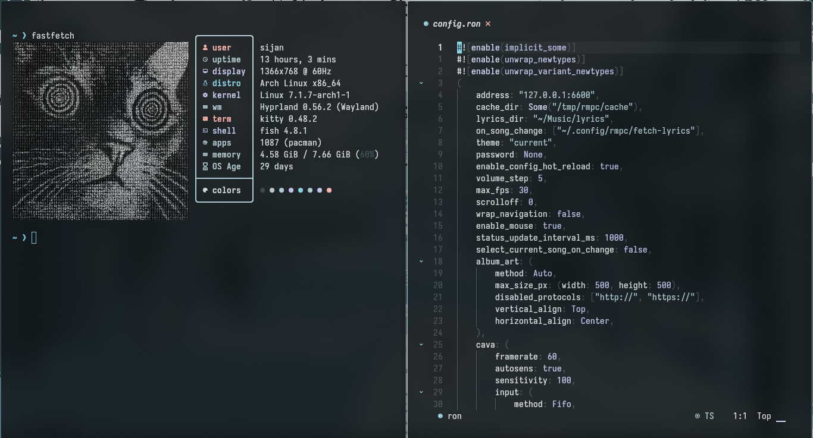
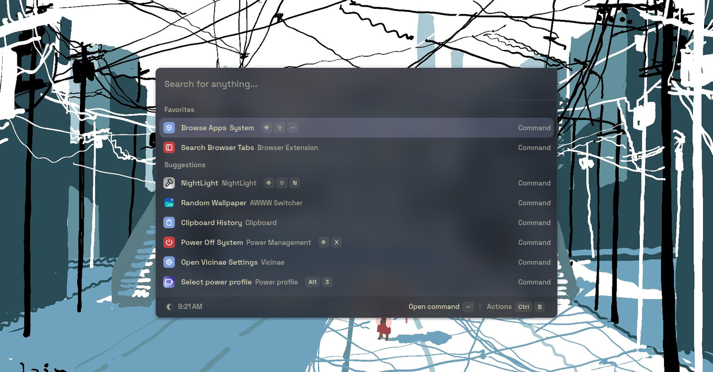
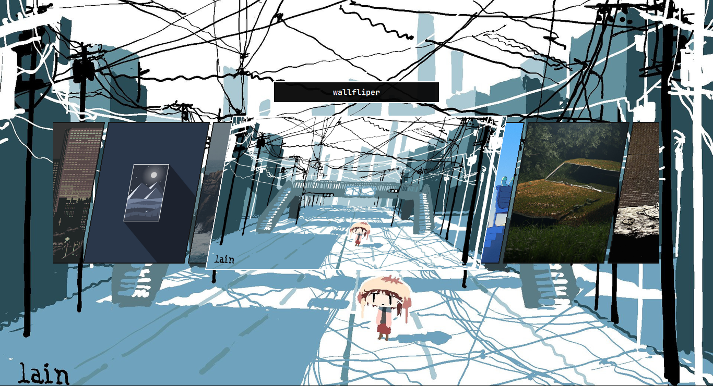
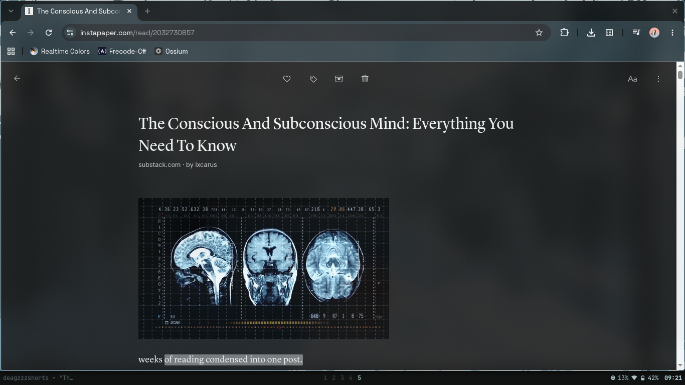
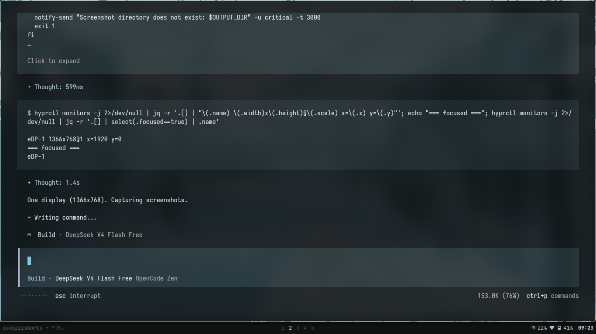

# Sizon Dotfiles

Hyprland Setup for arch , configs live in `configs/` and are symlinked into `~/.config` by `install.sh`.

## Screenshots

| | |
| --- | --- |
|  |  |
|  |  |
|  | |

## Layout

```
configs/        each app's config, symlinked to ~/.config/<name>
bin/            ~/.local/bin scripts (theme utilities + helpers) + hooks/
wallfliper/     wallpaper flipper app source (~/.local/share/wallfliper)
wallpapers/     curated default wallpaper set (6 images)
assets/         screenshots for the README
install.sh      installer
```

## Install

```sh
./install.sh                        # backup + symlink configs, copy scripts
./install.sh --wallpaper-switcher rofi     # use the rofi picker (no wallfliper app)
./install.sh --wallpaper-switcher wallfliper  # GUI app with video support (default)
./install.sh --install              # same + installs packages (Arch/paru, needs -y)
./install.sh --dry-run              # show what would happen
./install.sh --uninstall            # remove symlinks, restore from ~/.config-backup
```

Without `--wallpaper-switcher`, an interactive prompt asks which one to use.
The choice is stored in `~/.current_wallpaper_switcher` and the generic
`bin/wallpaper` front-end (used by all keybinds and autostart) dispatches to
the right one.

## Wallpaper switcher

Two interchangeable back-ends, both wired to the same bindings
(`ALT+SPACE` picker, `CTRL+ALT+SPACE` random, `SUPER+ALT+LEFT/RIGHT` cycle,
autostart restore) via `bin/wallpaper`:

- **wallfliper** (default) — GUI flipper app with video wallpapers (mpvpaper),
  animated transitions, and thumbnail previews. Installs the Python app to
  `~/.local/share/wallfliper` (vendored from upstream; see below).
- **rofi** — lightweight: `bin/wallpaper-rofi` shows a rofi menu of the
  wallpaper folder, applies the selection via `sizon` (awww + matugen + hooks).
  No Python app, supports `--restore/--random/--next/--prev`.

Switching later is a one-liner: rerun `./install.sh --wallpaper-switcher <name>`.

After the first link, run matugen against a wallpaper to populate the
generated theme:

```sh
matugen image ~/.config/matugen/generated/wallpaper   # or your wallpaper
```

Everything you change inside `~/Projects/dotfiles/configs/<name>` is live
immediately (symlinks). Commit changes in the repo.

## Dependencies

Arch packages: `hyprland hypridle hyprlock hyprsunset waybar swaync swayosd
kitty matugen fish fastfetch starship tmux yazi btop cava gtk3 gtk4
adw-gtk3 rofi awww ttf-space-grotesk ...`

wallfliper mode additionally needs: `pyside6 layer-shell-qt mpvpaper ffmpeg`.

`bin/` helpers may require: `wl-clip-persist cliphist polkit-gnome hyprpicker
grim slurp hyprlock playerctl pipewire-pulse bluez`.

## Theming

Colors come from matugen. Templates live in `configs/matugen/templates/`;
`config.toml` maps them to outputs. The generated files
(`matugen/generated/`, `hyprlock.conf`, `waybar/colors.css`, gtk colors,
`yazi/theme.toml`, `btop` theme, `cava` config, `starship.toml`) are
**not** in git — regenerate them with `matugen image <wallpaper>` or by
changing the wallpaper (`bin/wallpaper` picker/random, which calls matugen).

`bin/theme-switch` toggles between matugen (dynamic) and darky (static);
`bin/toggle-light-dark` toggles light/dark matugen palettes; `bin/sizon`
picks a random wallpaper. `bin/hooks/` applies colors to apps after a theme
change.

## Machine-specific tweaks

These are intentionally per-machine and may need editing after a fresh install:

- `configs/fastfetch/config.jsonc` — logo path (`~/Pictures/Camera/cam.png`).
- `configs/hypr/monitors.lua` — your display layout.
- `configs/hypr/hypridle.conf` — lock timeouts.
- Wallpapers — this repo ships a small default set in `wallpapers/`. Point
  wallfliper at your full collection:
  `~/.config/wallfliper/config.json` → `"wallpaper_dir": "~/Pictures/wallpapers"`.
- `~/.current_wallpaper_switcher` — which switcher is active; written by
  `install.sh` (falls back to auto-detect: wallfliper app present → wallfliper,
  else rofi). Theme state (`.current_theme_engine`, `.current_theme_mode`,
  `.current_wallpaper_index`) is created at runtime by the scripts.
- Absolute home paths in a few configs (`fish/fish_variables`, `btop.conf`,
  `gtk-3.0/bookmarks`, `swayosd/config.toml`, `swaync/style.css`) are authored
  for `/home/sijan`. `install.sh` rewrites them to your `$HOME` automatically
  when it differs (no-op on the author's machine).

## Wallfliper

Vendored wallpaper flipper app (excluding the optional `everforest` wallpaper
pack, ~1.1G). Upstream: https://github.com/Roberth-Souza/wallfliper — vendored
at commit `11d157d`; the live install lives at `~/.local/share/wallfliper`.
To update, copy newer upstream files over `wallfliper/` and commit.
